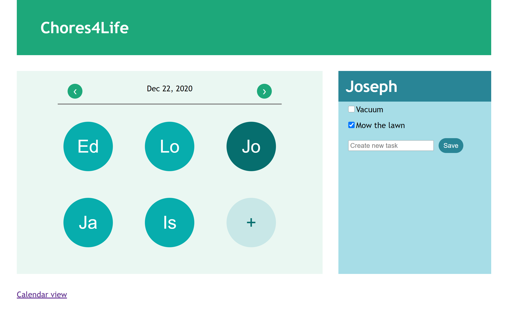

# Chore Management Web App - Chores4Life

## The Project

For my Technical Teamwork class, my team and I were tasked with creating a group project. We chose to design and implement a Wep App for managing chores, a project simple enough to be completed in 2 weeks, but that would also provide a challenge for us.

I was in charge of coding the app. One of the requirements we had created was the ability to add new users and assign tasks to each. We needed a way to connect our app to a MySQL database, and we decided to use PHP. I already had experience with MySQL, as well as HTML and CSS, but I had never used PHP. I spent several days learning the language and was finally successful in adding the database functionalities we needed. In addition to this, I also learned how to use phpMyAdmin and Wampserver to run the app on localhost.

While my focus is not specifically on Web Development, I have experience learning any new tools required to solve a problem.

## About the App

The app allows you to switch between a calendar view and a user view. Tasks are assigned in the user view, and can be checked off in either view. The calendar view will indicate which days have tasks to be performed, and will show the tasks for all users on that day.

### Calendar View

### User View

