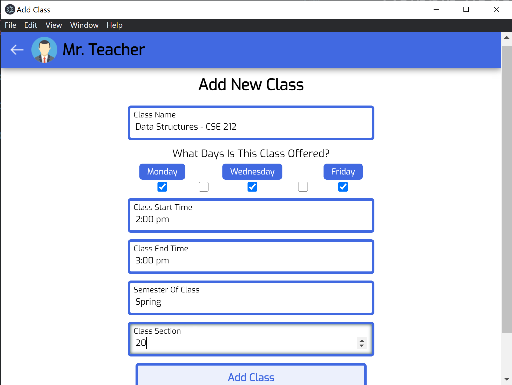
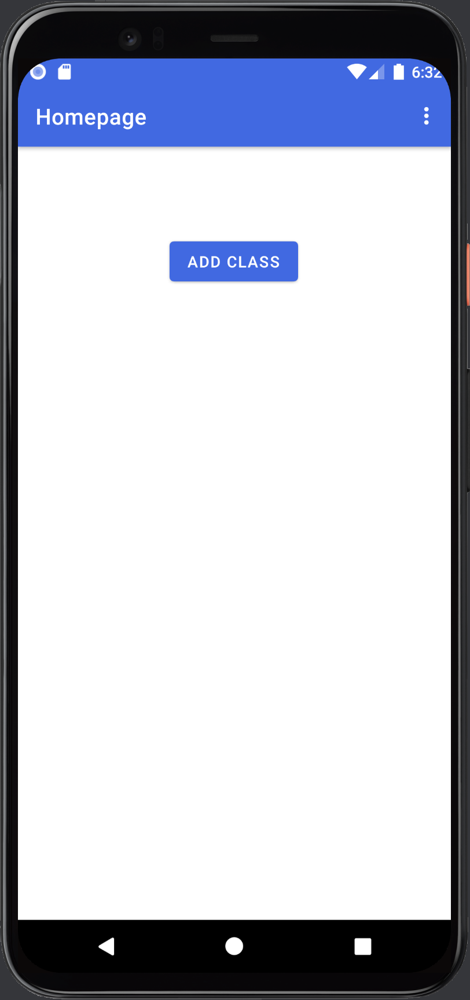
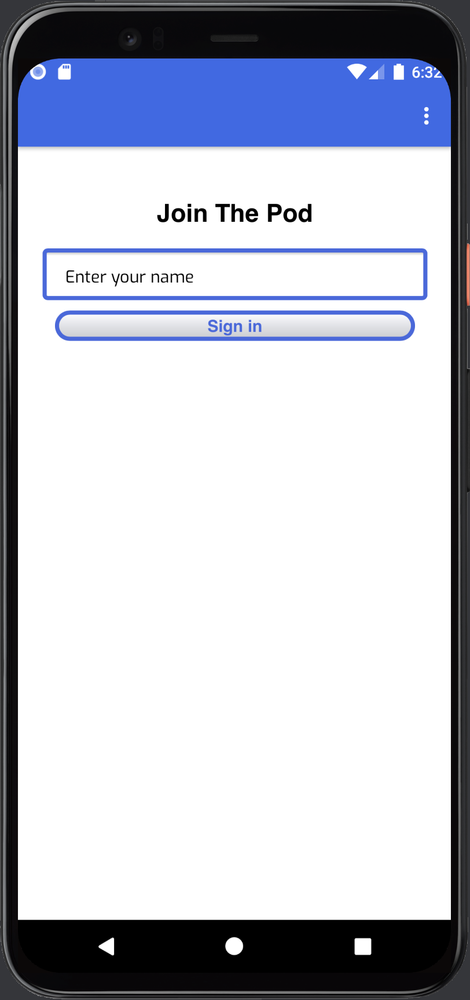
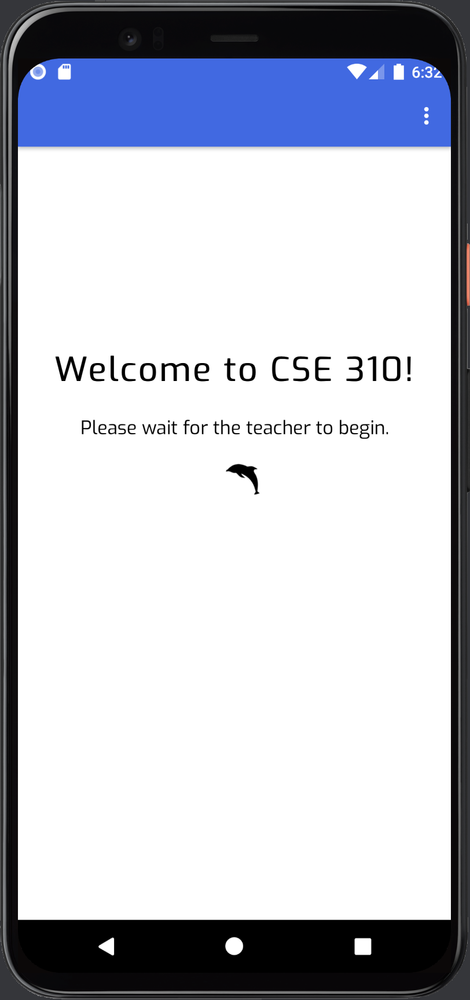
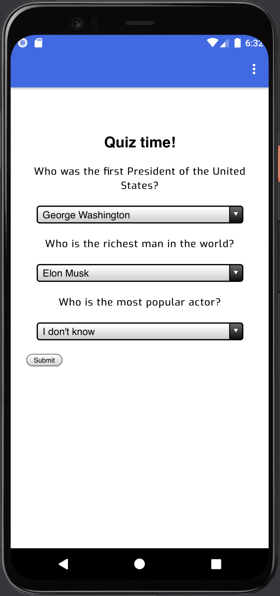
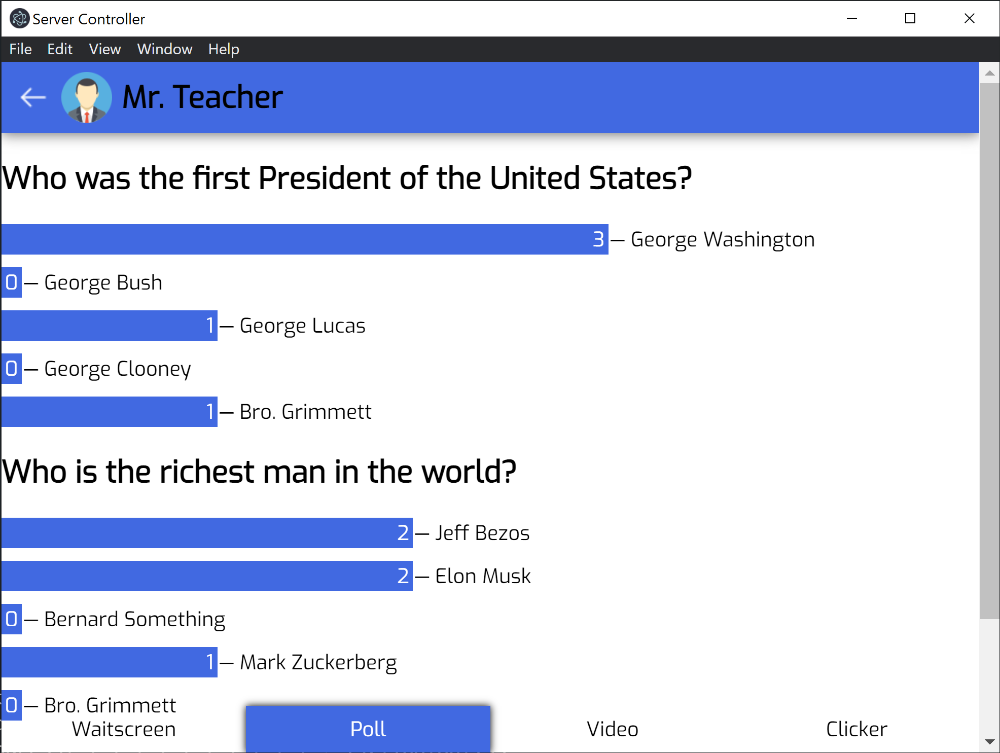

I was the team lead of a group of 5 for a project we called Dolphin Pods, a teaching activity tool allowing teachers to organize classes and plan activities for their students. This was part of our coursework for the Applied Programming class. At the start of the project, we decided what technologies we would like to learn throughout the semester and came up with a project that would help us gain experience with each one. We learned about agile development strategies and divided our project into several sprints that spanned 12 weeks of development.

The project consists of two companion apps: a desktop app used by the teacher to organize classes and plan activities, and a mobile app that enables students to connect to and participate in classroom activities.

## Technologies Used

The desktop app was created using Electron, and makes use of several Node.js libraries such as Express to handle the app's server and Socket.io to handle the connection with the mobile app.

The mobile app was developed using Kotlin.

## Organize Classes

*On the main screen, teachers can view their current classes and create new ones. From here, teachers can start the class, display a QR code that will connect the students to the class, or set up activities.*

*This screen allows the teacher to edit the class details.*

## Student Signin

*On the mobile app, students can press the Add Class button to connect to the classroom by scanning a QR code generated by the teacher.*

*Students enter their name and are taken to a waiting room until the teacher begins the class.*

## Quiz/Poll Activities

*Students can create quizzes and polls that are sent out to the students using Socket.io. The students' responses are recorded and displayed on the teacher's end.*

## Further Development

In addition to the class polls, we added functionality for the teacher to share YouTube videos with students, as well as have them compete in a dolphin clicker game, where each student is assigned a team and has to tap a dolphin icon to accumulate points.

Our development period was limited to 12 weeks, and we were unable to implement everything that we had planned. The project was intended less as a final product for an actual classroom and more as a way for us to learn new technologies and development skills as a team.

The full project can be found here on [GitHub](https://github.com/eddiemcconkie/cse310)