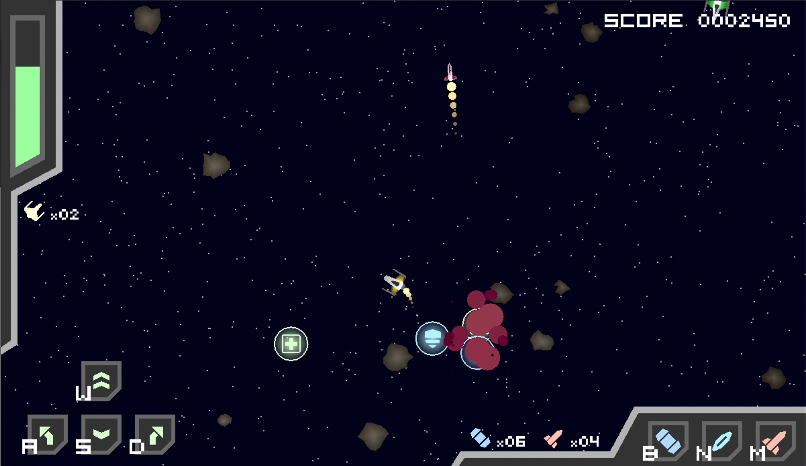
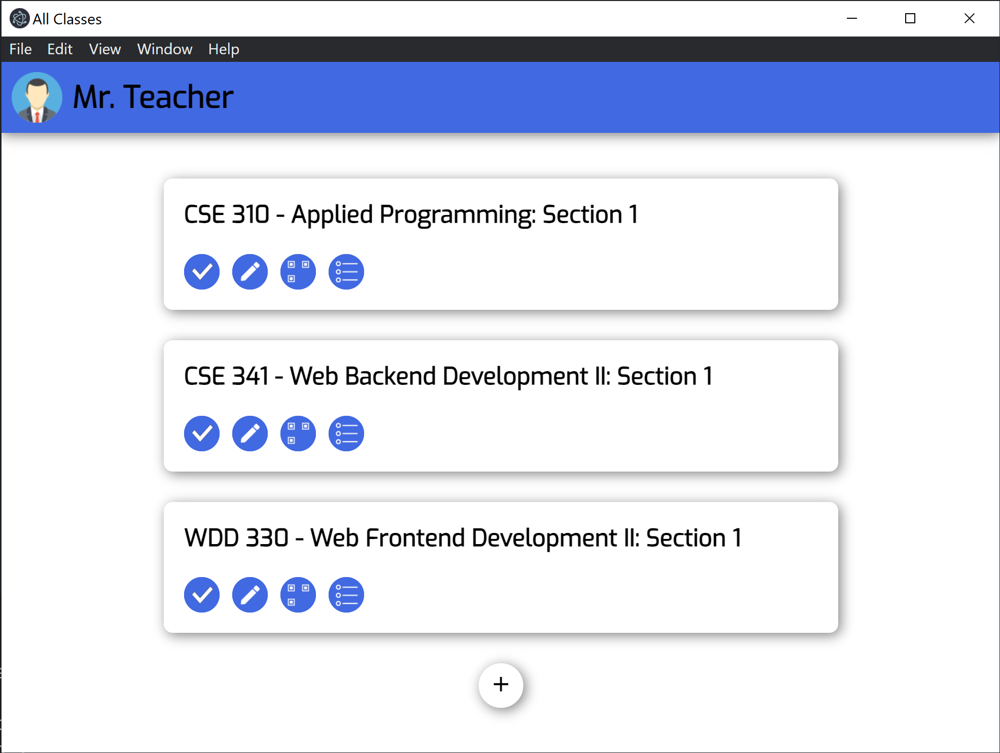
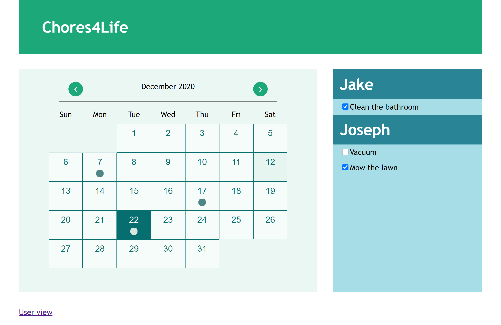

# Projects and Classwork

## Personal Projects

### [Web Frontend Development](frontend.md)

My Web Frontend Development course focused on designing and building webpages. The two major projects I worked on were a Chamber of Commerce website and a Weather site.

### [Moon Lander and Asteroids](asteroids.md)

For my OOP class, I worked on several big projects throughout the semester, including remakes of the classic games *Moon Lander* and *Asteroids*.

## Team Projects

### [Dolphin Pods](dolphinpods.md)

I worked as the team lead for a group of five students. We developed a teaching activity tool to help teachers organize classes and plan activities for their students, as well as a mobile companion app allowing students to participate in classroom activities.

### [PHP Calendar App](calendar.md)

For my Technical Teamwork class, I worked on a team of 4 to design and implement a Web App for managing chores. I was in charge of the coding, and used PHP to connect the web app to a database. The project took about 2 weeks.

